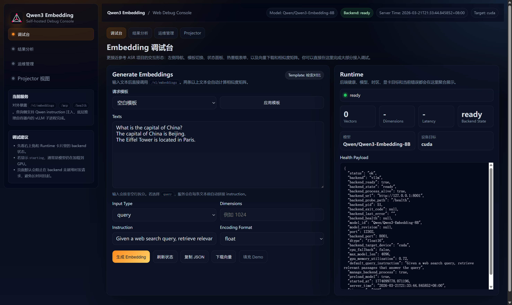
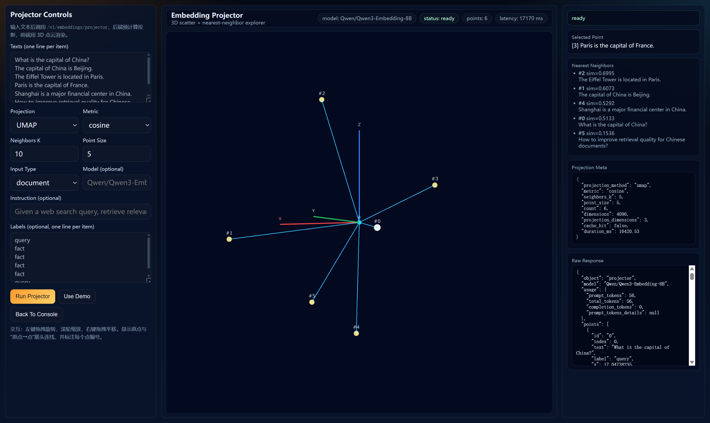

# Qwen3-Embedding：自托管 Embedding 推理服务

把 `Qwen/Qwen3-Embedding-8B` 封装成一个可自托管的 embedding 推理服务：
对外提供 OpenAI 兼容 Embeddings API、3D Projector API、HTTP MCP Server、内置调试控制台与 Projector 可视化页面，并附带 FastAPI 交互式接口文档，方便在内网/私有环境里快速接入与运维。

项目地址：
- 代码仓库：[`https://github.com/Scisaga/qwen3-embedding-openai`](https://github.com/Scisaga/qwen3-embedding-openai)
- 镜像仓库（GHCR）：`ghcr.io/scisaga/qwen3-embedding-openai:latest`




## 功能
- OpenAI 兼容 Embeddings API：`POST /v1/embeddings`
- 3D Projector API：`POST /v1/embeddings/projector`（后端预计算 3D 投影 + 近邻）
- Qwen 检索增强字段：`input_type=query|document`、`instruction`
- MCP Server：HTTP 挂载到 `POST/GET /mcp`（Streamable HTTP）
- 内置 Web UI：`GET /`（调试台、结果分析、运维管理）
- Projector 视图：`GET /projector`（3D 点云、原点连线、箭头、坐标轴、近邻联动）
- 交互式接口文档：`GET /docs`（Swagger UI）与 `GET /redoc`
- 模型自动下载与缓存：将 `./models` 挂载到容器 `/models`（Hugging Face 缓存目录）
- 运维友好：健康检查 `GET /health`；可选热重载 `POST /admin/reload`（`ADMIN_TOKEN` 保护）
- GitHub Actions：自动构建并发布 Docker 镜像到 GHCR（`.github/workflows/docker-publish.yml`）

## 快速开始
```bash
docker compose up -d --build
```

说明：仓库默认会为 `Qwen3-Embedding-*` 注入 vLLM 的 `hf_overrides={"is_matryoshka": true}`，避免旧版本 vLLM 误判 Qwen3 不支持自定义 `dimensions`。

如果机器需要走代理才能访问 Hugging Face，可在同目录创建 `.env`（或启动前导出环境变量）：

```bash
HTTP_PROXY=http://127.0.0.1:7890
# 可选：不走代理的地址（默认：localhost,127.0.0.1）
# NO_PROXY=localhost,127.0.0.1
```

打开：
- Web UI：http://localhost:12302/
- Projector：http://localhost:12302/projector
- MCP HTTP：http://localhost:12302/mcp
- 接口文档（Swagger）：http://localhost:12302/docs
- 接口文档（ReDoc）：http://localhost:12302/redoc
- 健康检查：http://localhost:12302/health

## OpenAI SDK 快速开始

```python
from openai import OpenAI

client = OpenAI(
    base_url="http://localhost:12302/v1",
    api_key="dummy",
)

response = client.embeddings.create(
    model="Qwen/Qwen3-Embedding-8B",
    input="What is the capital of China?",
    extra_body={
        "input_type": "query",
        "instruction": "Given a web search query, retrieve relevant passages that answer the query",
        "dimensions": 1024,
    },
)

print(len(response.data[0].embedding))
```

## curl 示例

### Embeddings
```bash
curl http://localhost:12302/v1/embeddings \
  -H "Content-Type: application/json" \
  -d '{
    "model": "Qwen/Qwen3-Embedding-8B",
    "input": [
      "What is the capital of China?",
      "The capital of China is Beijing."
    ],
    "input_type": "query",
    "instruction": "Given a web search query, retrieve relevant passages that answer the query",
    "dimensions": 1024
  }'
```

### Projector
```bash
curl http://localhost:12302/v1/embeddings/projector \
  -H "Content-Type: application/json" \
  -d '{
    "inputs": [
      "What is the capital of China?",
      "The capital of China is Beijing.",
      "Paris is the capital of France."
    ],
    "labels": ["query", "fact", "fact"],
    "projection_method": "umap",
    "metric": "cosine",
    "neighbors_k": 10,
    "point_size": 5
  }'
```

## MCP 快速开始

### HTTP MCP
服务启动后，MCP Streamable HTTP 入口固定为：

```text
http://localhost:12302/mcp
```

适合远端客户端或通过网关统一接入的场景。

## MCP 能力一览

### Tools
- `embed_text`
  - 入参：`texts`（必填，字符串或字符串数组）、`input_type`（可选）、`instruction`（可选）、`dimensions`（可选）
  - 返回：标准 OpenAI embeddings 响应形状
- `project_texts`
  - 入参：`texts`（必填）、`labels`（可选）、`projection_method`（可选，`umap|tsne|pca`）、`metric`（可选，`cosine|euclidean`）、`neighbors_k`（可选）、`point_size`（可选）
  - 返回：Projector 负载（`points`、`neighbors`、`projection_meta`）

### Resources
- `qwen3embedding://health`：当前模型、端口、backend 就绪状态、默认 instruction 等
- `qwen3embedding://usage`：MCP 工具参数说明与使用建议

### Prompts
- `retrieval_embedding_workflow`：指导客户端如何区分 query/document，并在 query 侧传入 instruction
- `projector_workflow`：指导客户端如何构建可视化聚类与近邻探索请求

## 架构说明
- **对外端口**：`PORT=12302`
- **容器内 vLLM**：默认监听 `127.0.0.1:8001`
- **工作方式**：外层 FastAPI 接收请求，必要时注入 Qwen query instruction，然后转发给容器内 `vLLM` 子进程
- **自动下载**：首次启动若本地缓存不存在模型，`vLLM` 会自动从 Hugging Face 拉取 `MODEL_ID`

这意味着你通常只需要访问：

```text
http://localhost:12302/v1/embeddings
```

无需直接访问容器内 `8001`。

## 接口一览
- `POST /v1/embeddings`
  - 标准字段：`input`、`model`、`dimensions`、`encoding_format`、`user`
  - 扩展字段：`input_type`、`instruction`
- `POST /v1/embeddings/projector`
  - 字段：`inputs`、`labels`（可选）、`input_type`（可选）、`instruction`（可选）
  - 投影参数：`projection_method=umap|tsne|pca`、`metric=cosine|euclidean`、`neighbors_k`、`point_size`
  - 返回：`points`（3D 坐标 + 文本元数据）、`neighbors`、`projection_meta`、`usage`
- `POST /mcp` / `GET /mcp`：MCP Streamable HTTP 入口
- `GET /docs` / `GET /redoc`：交互式接口文档
- `GET /openapi.json`：OpenAPI 规范 JSON
- `GET /health`：健康检查与运行参数
- `POST /admin/reload`：热重载模型（需 `x-admin-token`）

## GitHub Workflow：自动构建发布镜像

仓库内置工作流：`.github/workflows/docker-publish.yml`

- 触发条件：
  - push 到 `main`
  - push `v*` 标签
  - `pull_request` 到 `main`（仅构建，不推送）
  - 手动触发 `workflow_dispatch`
- 镜像仓库：`ghcr.io/<owner>/<repo>`
- 标签策略：`latest`（默认分支）、分支名、tag 名、commit sha

首次使用时请确保：

1. 仓库已开启 GitHub Packages（GHCR）权限
2. Actions 具备 `packages: write`（工作流已声明）
3. 如果仓库是组织仓库，组织策略允许 `GITHUB_TOKEN` 推送包

## Docker 部署示例
```bash
docker run -d --name qwen3_embedding_openai \
  --gpus all \
  -p 12302:12302 \
  -e MODEL_ID="Qwen/Qwen3-Embedding-8B" \
  -e HF_HOME="/models" \
  -v ./models:/models \
  ghcr.io/scisaga/qwen3-embedding-openai:latest
```

如果你绕过本仓库、直接调用原生 `vllm serve` 启动 `Qwen3-Embedding-*`，请显式追加：

```bash
--hf_overrides '{"is_matryoshka": true}'
```

否则某些 vLLM 版本会把 `dimensions=1024` 这类请求误判为不支持，返回 HTTP 400。

## 切换模型（需重启）
在 `docker-compose.yml` 中修改 `MODEL_ID`，然后：

```bash
docker compose up -d
```

## 模型热重载（无需重启）
```bash
curl -X POST http://localhost:12302/admin/reload \
  -H "Content-Type: application/json" \
  -H "x-admin-token: change-me" \
  -d '{
    "model_id":"Qwen/Qwen3-Embedding-8B",
    "max_model_len":4096,
    "gpu_memory_utilization":0.72
  }'
```

## 多 GPU 与选卡说明
- `deploy.resources.reservations.devices.device_ids` 可以显式绑定宿主机 GPU
- `NVIDIA_VISIBLE_DEVICES` 控制暴露宿主机哪一张卡给容器
  - `"0"` -> 宿主机第 1 张卡
  - `"1"` -> 宿主机第 2 张卡
  - `"0,1"` -> 同时暴露两张卡
- 如果只暴露一张卡，容器内 `vLLM` 会把它作为内部 `cuda:0` 使用，这是正常现象
- 多卡并行可通过 `VLLM_EXTRA_ARGS` 追加参数，例如：

```yaml
VLLM_EXTRA_ARGS: "--tensor-parallel-size 2"
```

## Projector 说明
- 前端采用 `Vite + Plotly`（目录：`frontend/`）
- Docker 构建会自动打包前端并复制到 `static/projector`，正常 `docker compose up -d --build` 后可直接访问 `/projector`
- 当前可视化为 3D 点云，包含：
  - 点编号标签
  - 原点及原点到各点连线与箭头
  - 三维坐标轴（X 红 / Y 绿 / Z 蓝）
  - 点击点后右侧展示近邻

本地前端开发：

```bash
cd frontend
npm install
npm run dev
```

本地前端打包：

```bash
cd frontend
npm install
npm run build
```

## 常用环境变量
在 `docker-compose.yml` 的 `environment` 里可调：
- `MODEL_ID`：模型 ID，默认 `Qwen/Qwen3-Embedding-8B`
- `PORT`：外层 FastAPI 端口，默认 `12302`
- `BACKEND_HOST` / `BACKEND_PORT`：容器内 vLLM 监听地址
- `HF_HOME`：模型缓存目录
- `DTYPE`：模型精度，默认 `float16`
- `MAX_MODEL_LEN`：最大上下文长度，默认 `4096`
- `MAX_DIMENSIONS`：输出向量维度上限，默认 `4096`
- `GPU_MEMORY_UTILIZATION`：vLLM 显存利用率，默认 `0.72`
- `DEFAULT_QUERY_INSTRUCTION`：query 侧默认 instruction
- `ADMIN_TOKEN`：热重载接口鉴权
- `VLLM_EXTRA_ARGS`：透传额外 vLLM 参数
- `PROJECTOR_CACHE_TTL_SECONDS`：Projector 结果缓存 TTL（秒）
- `PROJECTOR_CACHE_MAX_ITEMS`：Projector 缓存项上限

注意：
- 如果手动设置 `--max-num-batched-tokens`，它不能小于 `MAX_MODEL_LEN`；否则 vLLM 会在启动阶段报错退出。
- 不建议使用 `VLLM_PORT` 作为 wrapper 配置名。该变量会与 vLLM 内部端口逻辑冲突，可能造成误导日志。

## 测试
```bash
.venv/bin/python -m pytest --capture=no
```

## License
MIT License
